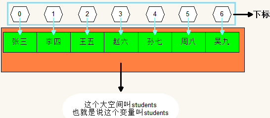
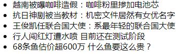
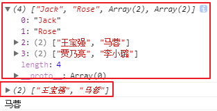
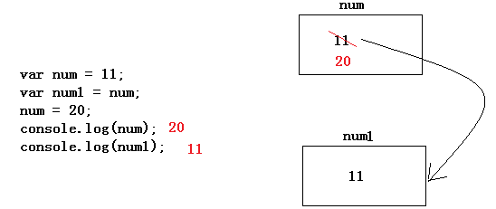
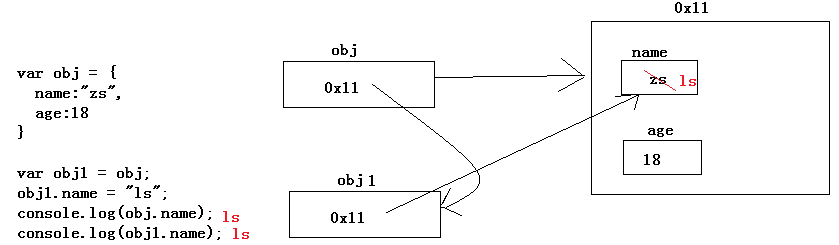
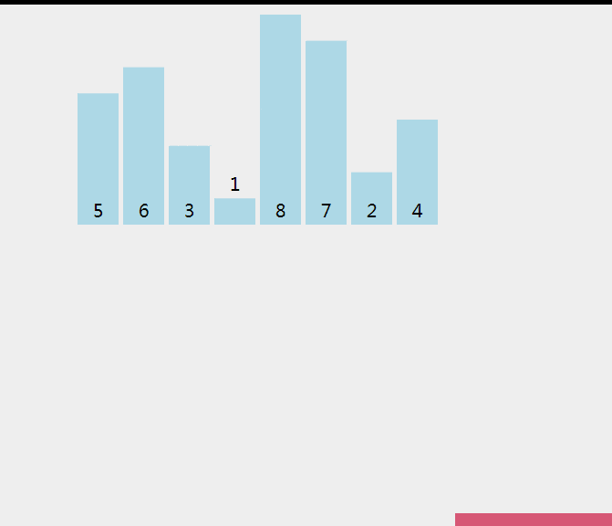

## 数组Array

### 引入：

我们知道一个变量存储一个值，一个变量是一个容器，如果给很多容器中都放入商品的话，我们就可以开超市了。我们都去超市买过东西，超市的东西都整齐的摆放在货架上，而不是所有的东西都堆在一起。为什么呢？因为便于管理商品。咱们代码中也有一个货架，叫数组，为了便于管理多个值的。

假设，我们现在要存一个班的所有学生姓名，如果每个姓名都存在一个变量中，就跟所有商品随便的堆在一起一样，不好管理，所以我们会存到数组中。

### 数组概念：

内存中的多个容器排列起来，组成的一个大容器。

数组中的每个小容器都有编号，第一个是0，第二个是1，。。。

咱们把编号叫做下标，来区分每个小容器。

| 数组示意图                                |
| ----------------------------------------- |
|  |

计算机内存中一段有序的连续空间，使用一个变量名表示

### 创建数组：

```shell
    语法一：
        var arr = []; # 创建了一个空数组
        var arr = ["张三","李四","王五"]; # 创建了一个数组，里面存了三个姓名
    语法二：
        var arr = new Array(); # 创建了一个空数组
        var arr = new Array(3); # 创建了一个长度为3的数组
        var arr = new Array("张三","李四","王五"); # 创建了一个数组，里面存了三个姓名
```

使用构造函数的方式创建数组的时候，如果其中只有一个整数，表示数组的长度，如果是多个值，代表是数组中的多个值，如果只有一个值，但不是整数，要报错。

求数组的长度：arr.length 

这个length属性可以读，也可以写。也就是说可以查看长度，也可以修改长度。

获取数组中的值：

```shell
数组变量[下标]; # 第一个元素的下标是0，第二个是1，。。。
```

代码：

```javascript
var arr = ["张三","李四","王五"];
console.log(arr); // (3) ["张三", "李四", "王五"]
console.log(arr[1]); // 李四
console.log(arr[3]); // undefined
```

<font color="yellowgreen">数组也是对象</font>

### 数组操作：

```shell
数组[下标] = 值;
```

如果下标不存在，就是给数组增加元素

如果下标已经存在，就是将数组中的元素修改。

清空数组：

```js
arr = [1,2,3,4,5];
arr = [];
或
arr.length = 0;
```

通常，数组中的元素可以是任意类型的数据。一般情况，在数组中的每个元素都是同样的类型，但从语法上来说，数组中的每个元素的类型可以不一样。

```javascript
var arr = [1,3.14,"Rose",true,null];
console.log(arr); // (5) [1, 3.14, "Rose", true, null]
arr[4] = "Jack";
conole.log(arr); // (5) [1, 3.14, "Rose", true, "赵六"]
```

总结规律：

​	数组中第一个元素的下标是0。

​	数组中最后一个元素的下标是数组元素的个数减1。

​	数组的空间是可扩展的。可以在其后面继续添加元素。

### 练习：

例：利用for循环遍历数组----遍历：漫山遍野的经历

```js
var arr = [10,20,30,40,50]
for(var i = 0;i < arr.length; i++){
	document.write(arr[i]);
}
```

例：利用for循环求数字数组中所有元素的和

```js
var arr = [10,20,30,40,50];
var sum = 0;
for(var i = 0;i < arr.length; i++){
	sum += arr[i];
}
alert(sum);
```

练习：

for循环有一种专门用来遍历的写法：

```shell
语法：
	for(var i in Array){
        要执行的代码
	}
# 在这个语法中，i代表数组中的下标，每循环一次，下标递增1
```

例：利用for in 来遍历的数组

```javascript
var arr = [10,20,30,40,50];
for (var i in arr) {
	console.log(arr[i]);
}
```

<font color="red">**注意：for in中的i变量类型是字符串，而不是数字类型，所以for in专门用来遍历对象，for in不会遍历空元素**</font>

例：利用for in 求数组中所有元素的和

```javascript
var arr = [10,20,30,40,50];
var sum = 0;
for (var i in arr) {
	sum += arr[i];
}
alert(sum);
```


​	有一个数组，具体内容如下：

```javascript
var arr = [
    "越南被曝咖啡造假：咖啡粉里掺加电池芯",
    "抗日神剧被当教材：机密文件居然有女优名字",
    "王俊凯任联合国大使：系最年轻的联合国大使",
    "行人闯红灯遭水喷 目前还在测试阶段",
    "68条鱼估价超600万 什么鱼要这么贵？"
]
```

​	利用循环使用js做出如下图效果：

| 效果图（参考网址：http://news.szhk.com/） |
| ----------------------------------------- |
|  |

代码：

```javascript
var arr = [
    "越南被曝咖啡造假：咖啡粉里掺加电池芯",
    "抗日神剧被当教材：机密文件居然有女优名字",
    "王俊凯任联合国大使：系最年轻的联合国大使",
    "行人闯红灯遭水喷 目前还在测试阶段",
    "68条鱼估价超600万 什么鱼要这么贵？"
];
document.write("<ul>");
for(var i=0;i<arr.length;i++){
	document.write("<li>");
	document.write(arr[i]);
	document.write("</li>");
}
document.write("</ul>")
```

优化：循环中输出的是三个字符串，那么可以简化为一个输出，将三个字符串拼接起来。

因为循环中的条件要执行很多次，但是数组的长度是不会变的，所以在循环中每次都求数组的长度会很耗费资源。应该将数组的长度定义在循环外面，在循环中只需要使用固定的长度值即可。

例：

```javascript
var arr = [10,20,30,40,50]
var length = arr.length;
for(var i = 0;i < length; i++){
    document.write(arr[i]);
}
```

把1~100这个100个数字存到数组中

<font color="blue">思考：数组中的类型是没有限制的，那么数组中可以存储数组吗？</font>

### 二维数组

```javascript
var arr = [
		"Jack",
		"Rose",
		["王宝强","马蓉"],
		["贾乃亮","李小璐"]
	];
	console.log(arr);
	console.log(arr[2]);
	console.log(arr[2][1]);
```

效果：

| 效果图                                    |
| ----------------------------------------- |
|  |

包含数组的数组，叫做多维数组，我们用的最多的就是二维数组。

### 基础类型和引用类型

简单类型传递值，复杂类型传递地址

简单数据类型：number、string、boolean、undefined、null

复杂数据类型：Array、function, Object

其实函数也是一种类型：

```javascript
function abc(){}
console.log(typeof abc); // function
```


值传递时将内存空间的值直接改变

代码：

```javascript
var num = 11;
var num1 = num;
num = 20;
console.log(num);
console.log(num1);
```

过程：

| 值传递过程                                |
| ----------------------------------------- |
|  |

引用传递时将值改变了，但是地址没有改变

代码：

```javascript
var obj = {
  name:"2s",
  age:18
}

var obj1 = obj;
obj1.name = "ls";
console.log(obj.name);
console.log(obj1.name);
```

过程：

| 引用传递过程                              |
| ----------------------------------------- |
|  |

练习：

```javascript
//1.
function fn(a, b) {
  // 相当于
  //  var a = 10;
  //  var b = 20;
  // 函数的参数 其实就是函数内部的局部变量
  a = a + 1;
  b = b + 1;
  console.log(a);
  console.log(b);
}

var x = 10;
var y = 20;
fn(x, y);
console.log(x);
console.log(y);

//2.
var p = {
  name:"zs",
  age:18
}
function fn(person) {
  person.name = 'ls';
  console.log(person.name);
}
fn(p);
console.log(p.name);

//3.  
function Person(name, age, salary) {
   this.name = name;
   this.age = age;
   this.salary = salary;
 }
 function f1(person) {
   person.name = "ls";
   console.log(person.name);
 }
 var p = new Person("zs", 18, 1000);//创建一个新对象
 console.log(p.name);//
 f1(p);
 console.log(p.name);//
```

结论：简单类型存储的是值本身，复杂类型存储的是地址，引入如果把第一个对象赋值给另一个变量，此时两个变量会指向同一个对象。

### 数组操作的方法

- splice : 数组任意地方删除或者添加元素 

  ```js
  var arr = ['zs','ls','ww','zl','xmg'];
  // 原来的数组影响
  //- splice(start, deletedCount)   删除元素
  // 		- start 开始
  // 		- deletedCount 删除个数
  //- splice(start, deletedCount , item) 删除+添加,  第三个参数是在原来删除的位置上新加几个元素
  //- 特殊 : 
  //   splice(start, 0 , item)   就是在某个位置新加元素
  ```

  

-  数组的增删操作

  ```js
  var arr = ['zs','ls','ww']
  
  array.push(元素);//从后面添加元素，返回新数组的length
  array.pop();//从数组的后面删除元素，返回删除的那个元素
  array.unshift(元素);//从数组的前面的添加元素，返回新数组的长度
  array.shift();//从数组的最前面删除元素，返回删除的那个元素
  
  //总结:
  //1. shift 在前面 ,所以处理数组前面的
  //2. p+ 在后面,所以是处理后面的
  //3. unshift 比 shift 多个un,,所以就是加
  //4. 添加的都是返回长度
  //5. 删除的都是返回删除的元素
  //6. 添加要说明添加什元素,,删除直接删除
  
  //练习1
  var arr = ["刘备"];
  //添加数据后变成：["赵云","马超","刘备","关羽","张飞"]
  //删除数据后变成：["关羽","张飞"]
  
  //练习2
  var arr = ["赵云","马超","刘备","关羽","张飞"];
  //把数组的最后一个元素变成数组的第一个元素
  //把数组的第一个元素变成数组的最后一个元素
  ```

  

- 数组的拼接

  ```js
  //concat：数组合并，不会影响原来的数组，会返回一个新数组。
  var newArray = array.concat(array2);
  ```

  

- 数组的排序

  ```js
  array.sort();//数组的排序，默认按照 字母/首字符 顺序排序 => 1 11 2 3
  var arr1 =  ['a','d','b','c'];
  var arr2 = [3, 6, 1, 5, 10, 2,11];
  
  //sort方法可以传递一个函数作为参数，这个参数用来控制数组如何进行排序
  arr.sort(function(a, b){
    //如果返回值>0,则交换位置
    return a - b;
  });
  
  记忆 : b比a高
  ```

  

- 数组的反转

  ```js
  array.reverse();//翻转数组
  ```

  

- 数组和字符串的转换

  ```js
  //语法：array.join(分隔符)
  //作用：将数组的值拼接成字符串,并且返回字符串
  
  var arr = [1,2,3,4,5];
  arr.join();//不传参数，默认按【,】进行拼接
  arr.join("");//按【"】进行拼接
  arr.join("-");//按【-】进行拼接
  
  //split:将字符串分割成数组（很常用）
  //功能和数组的join正好相反。
  var str = "张三,李四,王五";
  var arr = str.split(",");
  ```

  

### 冒泡排序

相邻两个元素进行比较，将一个数组中的数字使用循环进行升序或降序的排列

```javascript
// var arr = [1,2,3,4]; // arr = [4,3,2,1]
/*for(var i=0;i<3;i++){
	if(arr[i]<arr[i+1]){
		var a = arr[i];
		arr[i] = arr[i+1];
		arr[i+1] = a;
	}
	// [2,1,3,4]
	// [2,3,1,4]
	// [2,3,4,1]
}
console.log(arr);
for(var i=0;i<3;i++){
	if(arr[i]<arr[i+1]){
		var a = arr[i];
		arr[i] = arr[i+1];
		arr[i+1] = a;
	}
	// [3,2,4,1]
	// [3,4,2,1]
	// [3,4,2,1]
}
console.log(arr);
for(var i=0;i<3;i++){
	if(arr[i]<arr[i+1]){
		var a = arr[i];
		arr[i] = arr[i+1];
		arr[i+1] = a;
	}
	// [4,3,2,1]
	// [4,3,2,1]
	// [4,3,2,1]
}
console.log(arr);*/

/* 冒泡排序 */
var arr = [1,2,3,4];
for(var j=0;j<3;j++){
	for(var i=0;i<3;i++){
		if(arr[i]<arr[i+1]){
			var a = arr[i];
			arr[i] = arr[i+1];
			arr[i+1] = a;
		}
	}
}
console.log(arr);
```


| 冒泡排序示意图           |
| ------------------------ |
|  |

### 选择排序

降序：先找最大值，排在最左边，再找第二大的值，往左边靠...，已经排好的，不再参与比较

```javascript
var arr = [1,2,3,4];
// 让每个位置上的数都和其他位置上的数进行比较
// 第一次让arr[0]和所有其他位置上的数进行比较   比较3次，将第一个位置的数确定下来
// 第二次让arr[1]和剩下所有位置上的数进行比较   比较2次，将第二个位置的数确定下来
// 第三次让arr[2]和剩下所有位置上的数进行比较	  比较1次，将第三个位置的数确定下来
var arr = [1,2,3,4];
var tmp;
for(var i = 0; i < arr.length-1; i++){
	for(var j = i + 1; j < arr.length; j++){
		if(arr[i] < arr[j]){
			tmp = arr[i];
			arr[i] = arr[j];
			arr[j] = tmp;
		}
		console.log(arr);
	}
}
```


| 选择排序示意图           |
| ------------------------ |
|  |


### 随机点名程序

```js

```

