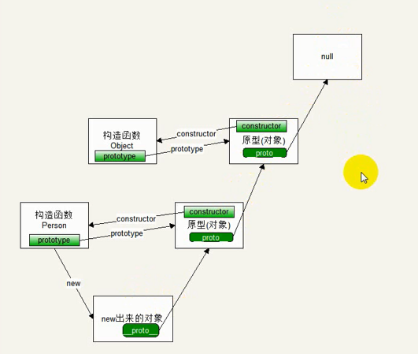

1、创建对象的两种方法：

### 1、json形式创建

```js
let obj = {};
```

2、构造函数方式

```js
let obj = new Object();
```

对象的操作

增：对象.属性名 = 值     //属性名必须是对象中不存在的

删：delete 对象.属性名

改：对象.属性名 = 值     //属性名必须是对象中存在的

查：对象.属性名

### 2、对象(键值对)的组成

```js
{
	属性名(键):属性值(值)
}
```

### 3、工厂函数

```js
function Fn(name, age){
	let obj = {
		name: name,
		age: age,
		eat: function(){
			console.log("能吃")
		}
	}
	return obj;
}
let obj1 = Fn("张三",20);
let obj2 = Fn("张四",21);
console.log(obj1);//{ name: '张三', age: 20, eat: [Function: eat] }
console.log(obj2);//{ name: '张四', age: 21, eat: [Function: eat] }
console.log(obj1.eat === obj2.eat);//false
```

```js
function Fn(name, age){
	let obj = new Object();
	obj.name = name,
    obj.age = age,
    obj.eat = function(){
    	console.log("能吃")
    }
	return obj;
}
let obj1 = Fn("张三",20);
let obj2 = Fn("张四",21);
console.log(obj1);//{ name: '张三', age: 20, eat: [Function] }
console.log(obj2);//{ name: '张四', age: 21, eat: [Function] }
console.log(obj1.eat === obj2.eat);//false
```

缺点：不能分辨具体的对象类型。(例：Math、Date、MouseclickEvent、MousecverEvent)

### 4、构造函数

```js
function Fn(name, age){
	this.name = name;
	this.age = age;
}
let obj = new Fn("jack",20);
console.log(obj);//Fn { name: 'jack', age: 20 }Fn是对象详细类型
```

使用构造函数创建对象的时候，new的时候，发生了以下步骤：

1：函数中创建了一个空对象。

2：将函数中的this指向这个空对象。

3：执行函数中的代码（为这个空对象添加属性）。

4：返回这个对象。

构造函数的要求：

1、构造函数必须和new配合使用，否则就没有创建对象的功能。

2、构造函数中不允许有return，如果构造函数中return了一个基本类型，return不会生效。如果return了一个复杂类型，构造函数就失去了意义了。

3、通常情况下构造函数的首字母是大写的：Object、Array、Date。

4、如果构造函数不需要参数，那么new的时候可以省略小括号。

缺点：同样的函数占用不同的空间，造成内存浪费。(解决方法：原型)

### 5、原型

### 6、原型链



### 7、方法

Object的每个实例都具有下列属性方法：
1.constructor：保存着用于创建当前对象的函数 上面例子 构造函数就是 Object()
2.hasOwnProperty(prop):检查给定的属性是否在当前对象实例中（而不是在实例的原型中）。作为参数的属性必须以string形式指定(返回值为布尔值)

```js
// // 有一个对象dog，dog具有属性eat，该eat属性继承于某个原型对象。现想要找到此原型对象，为此类需求写出一个通用的方法
function Dog() {

}
Object.prototype.eat = "能吃";
// Dog.prototype.eat = "不能吃";
let a = new Dog();

//只有hasOwnProperty可以给出正确和期望的结果，尤其在遍历一个对象时
//除了hasOwnProperty外，没有其他方法可以排除原型链上的属性（不是定义在对象自身上的属性）
const recursion = (obj, attr) => {
	let b = obj.__proto__;
	if(!obj){
		console.log("未查到有该属性");
	}else if (b.hasOwnProperty(attr)) {
		console.dir(obj.__proto__.constructor);
	} else {
		recursion(obj.__proto__, attr);
	}
}
recursion(a, "eat");
```

3.isPrototypeOf(object):用于检查传入的对象是否是另一个对象的原型。
4.propertyIsEnumerable(propertyName)：用于检查给定的属性是否能够使用for in语句
5.toLocaleString():返回对象的字符串表示，与环境的地区对应
6.toString():同上
7.valueOf(): 返回对象的字符串、number、Boolean表示。通常与toString()相同